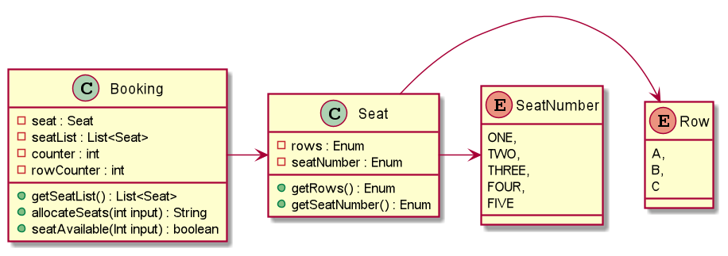

# Cinnamon Cinemas Movie Theatre Seating Challenge

**Setting the Scene**

You have a special task from Cinnamon Cinemas to develop a program to allocate seats to customers purchasing tickets for a movie theatre.  Cinnamon Cinemas provided some criteria for how the program should be built. 

**Cinnamon Cinemas' Criteria**

* Well-designed and tested code representing real-world scenarios
* Evidence of Test-Driven Development being applied
* Clear communication and documentation 

**Cinnamon Cinemas Business Requirements**

The Cinnamon Cinemas Movie Theatre has 15 seats, arranged in 3 rows of 5
Rows are assigned a letter from A to C
Seats are assigned a number from 1 to 5 

**User Story**

As a Cinnamon Cinemas Movie Theatre Manager, I want to allocate seats to customers
So that I can control reserved seating for the theatre

* **GIVEN** a customer wants to request some tickets
* **WHEN** they request a number of seats between 1 and 3 for a movie
* **THEN** the customer should be allocated the required number of seats from the available seats on the seating plan 
* AND the seats should be recorded as allocated

**Acceptance Criteria and Assumptions**
* Write a program that allocates seats based on a random integer “number of seats” between 1 and 3
* Your program should allocate the required number of seats from the available seats starting from seat A1 and filling the auditorium from  left to right, front to back
* All the seats are available for sale when the program starts
* The program should continue to allocate a random number of seats until it finds there are not enough seats left to complete the request Once there are not enough seats available to be allocated then the program can halt 

**Implementation**

* Starting with TTD approach. I started by creating simple tests first to check if single seat is available, then creating more tests with incrementing the seat requests. 
* Seat class is a model class which will hold 3 rows (A, B, C) and 5 columns. 
* Enum classes to hold the row names (A, B, C) and column name (1, 2, 3, 4, 5).
* Booking class will be controller class that implements methods to check for valid inputs, check for available seats and finally allocate the seats.
* Saving the seats in a List object, so that they can be used for future operations.

** Class Diagram **

**Future Enhancements**

* Displaying the reserved seat numbers for the customer in form of Matrix of Row and Seatnumber. 
* Allowing user to select preferred seats and continue to reserve if available.
* Increasing the number of seats in the Movie Theatre

**Technologies Used**
* Java
* maven
* JUnit 5